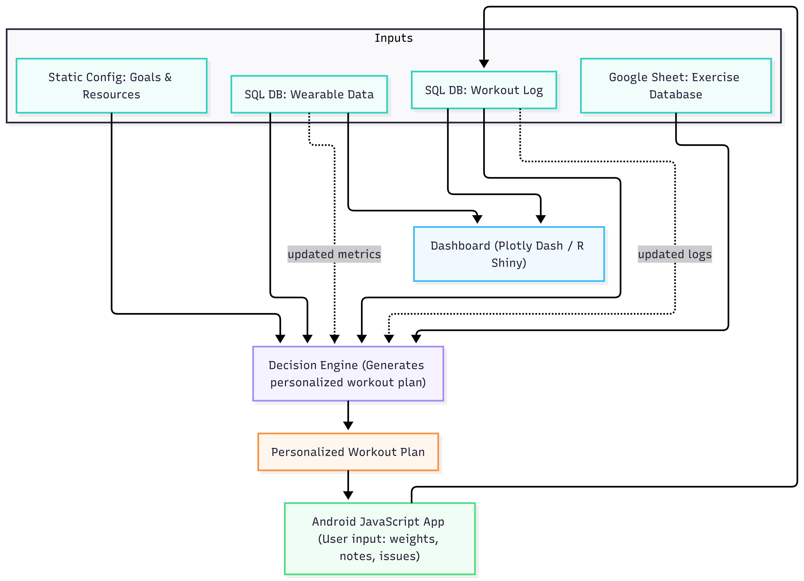

# active_progress
Applet development for progressively getting better in your active lifestyle so you can stay healthy between your work-life balance. 

## Summary

Active Progress is a local-first fitness and routine planning tool designed to generate personalized programs based on real-world lifestyle constraints and habits. It focuses on privacy: all data, models, and dashboards run on the user's own machine rather than in a third-party cloud.

The project uses Python for the core logic and data handling, with HTML and JavaScript providing an interactive interface for defining goals, entering routines, and reviewing suggestions. The long-term goal is to integrate wearable and schedule data into a predictive workflow that helps adjust daily plans when sleep, stress, or workload change.

Active Progress is currently under active development as a side project. The codebase and contribution workflow are structured to invite focused community contributions while keeping architecture and roadmap decisions maintainer-led.

## Current Development in Progress 
- Building a database of exercises
- Backend LLM training to provide summaries
- Java fronted for phone app data input 

## Workflow 

## Contributing 

Contributions are welcome, especially bug reports, documentaiton improvements, UI ideas, testing feedback, and focused pull requests. 

Active progress is maintained with a guided contribution workflow. The project is open to community input, but architecture, roadmap direction, and final merge decisions remain maintainer-ied. 

### Contribution Workflow 

1. Open an issue before starting larger changes. 
    - Use the issue to describe the problem, proposed approach, and any questions about scope.
    - This helps prevent duplicated work and keeps development aligned with the project roadmap. 

2. Fork the repository and create a feature branch. 
    - Use a short, descriptive branch name such as 'fix/login-bug' or 'feature/program-generator'.

3. Keep pull requests focused. 
    - Submit one clear improvement per pull request whenever possible. 
    - Smaller PRs are easier to review and merge.
    
4. Explain the change clearly.
    - Include what changed, why it matters, and anything reviewers should pay attention to.
    - Link the related issue when applicable.
    
5. Test your changes before submitting.
   - Verify that the relevant functionality works as expected.
   - Update or add documentation when behavior, setup, or usage changes.

6. Expect review before merge.
   - Feedback, revision requests, or design discussion may be part of the process.
   - Pull requests are merged at maintainer discretion to preserve project consistency.

    
### Good first contributions

Helpful ways to contribute include:
- Fixing bugs.
- Improving documentation and setup instructions.
- Refining the HTML/JavaScript interface.
- Improving Python backend structure and test coverage.
- Suggesting usability improvements for the privacy-first workflow.

### Project direction

This project is actively developed, but not on a full-time schedule. Review times may vary.

To keep the project cohesive:
- Major architectural changes should be discussed in an issue first.
- New features should fit the privacy-first, local-first design goals.
- Contributors are encouraged to propose ideas, but not every proposal will be merged.

### Maintainer role

Community contributions are encouraged, but the repository is curated by the primary maintainer. That means:
- Roadmap priorities are set by the maintainer.
- PRs may be revised before merge.
- Some contributions may be declined if they do not fit the long-term direction of the project.

Thanks for helping improve Active Progress.